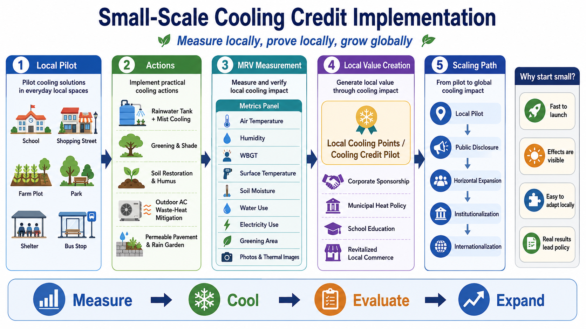

# Cooling Credit Local Pilot Model

## A Small-Scale Local Implementation Framework for Measuring, Cooling, Evaluating, and Scaling Natural Cooling Value

[日本語](README_ja.md) | [English](README.md) | [العربية](README_ar.md)

Related NOTE article: [クーリングクレジット小規模導入モデル](https://note.com/inchacomusho/n/n7d8b58455ead)



---

## Abstract

The **Cooling Credit Local Pilot Model** is a practical framework for starting Cooling Credit from small, measurable, local implementation sites such as schools, shopping streets, parks, farm plots, shelters, bus stops, public facilities, and neighborhood-scale heat-stress zones.

This model is based on a simple premise:

```text
Do not wait for global consensus.
Measure locally.
Cool locally.
Evaluate locally.
Scale globally.
```

Conventional climate policies often begin with global agreements, national targets, emissions accounting, carbon markets, and long-term institutional design. These are important, but local heat risk is already present. Schoolyards, paved shopping streets, bus stops, outdoor shelters, farms, and urban public spaces are already experiencing severe heat stress.

Cooling Credit should therefore begin as a **small-scale local pilot**, not as a fully mature international financial instrument. The purpose of the local pilot model is to create visible, measurable, and verifiable cooling results, then convert those results into local value through community participation, municipal policy, education, corporate sponsorship, and future institutionalization.

---

## 1. What Is Cooling Credit?

Cooling Credit is a proposed value-evaluation framework for actions that produce measurable cooling effects and restore natural cooling functions.

Unlike conventional climate instruments that mainly focus on greenhouse gas emissions, Cooling Credit asks a more direct question:

```text
Did the place actually become cooler?
Was local heat stress reduced?
Were natural cooling functions restored?
```

Cooling Credit evaluates not only CO₂ reduction, but also physical cooling, heat-load reduction, evapotranspiration recovery, water-cycle restoration, soil moisture, vegetation, shade, surface temperature reduction, waste-heat mitigation, and measurable improvements in local thermal environments.

This repository focuses on the **local pilot model**: the minimum practical structure for starting Cooling Credit at a small regional scale.

---

## 2. Why Start Small?

Waiting for a global agreement may take too long. Local heat stress does not wait for international negotiations.

Small-scale implementation has four major advantages:

```text
1. It can begin immediately.
2. The effects are visible.
3. It can be adapted to local conditions.
4. Real results can lead policy.
```

A small pilot site allows participants to compare conditions before and after implementation. It also allows residents, schools, businesses, municipalities, and local organizations to understand the result directly.

For example:

```text
A schoolyard surface becomes cooler.
A shopping street WBGT decreases.
A park gains more shade.
A farm plot retains more soil moisture.
Outdoor AC waste heat is reduced.
Rainwater is used for local mist cooling.
```

These results are easier to explain than abstract emissions accounting. They create a direct bridge between climate adaptation, public health, education, disaster prevention, and regional revitalization.

---

## 3. Basic Structure of the Local Pilot Model

The model consists of five stages:

```text
1. Local Pilot
2. Cooling Actions
3. MRV Measurement
4. Local Value Creation
5. Scaling Path
```

The model is intentionally simple. It is designed so that schools, local governments, shopping streets, farms, community groups, companies, and public facilities can start without waiting for a national or global certification system.

---

## 4. Stage 1: Local Pilot

The first step is to define a small and visible pilot area.

Examples include:

```text
School
Shopping street
Farm plot
Park
Shelter
Bus stop
Station square
Public facility
Factory site
Housing complex
Elderly-care facility
Municipal property
```

The key is to define the boundary clearly.

A pilot should not begin with an entire city. It should begin with a measurable place:

```text
one schoolyard
one shopping street block
one park zone
one farm plot
one shelter area
one bus stop
one outdoor AC zone
```

A clearly defined site makes before-and-after comparison easier and reduces measurement complexity.

---

## 5. Stage 2: Cooling Actions

Local cooling actions should be selected according to regional conditions.

Typical interventions include:

```text
Rainwater tank + mist cooling
Greening and shade creation
Soil restoration and humus formation
Outdoor AC waste-heat mitigation
Permeable pavement and rain gardens
Tree planting
Wall greening
Rooftop greening
Measured rainwater cooling
Food-waste composting
Leaf litter and pruning residue return to soil
```

The model should avoid single-solution thinking. Heat stress is usually caused by multiple factors: surface heating, lack of shade, low soil moisture, weak evapotranspiration, high waste heat, poor airflow, and water-cycle disruption.

Therefore, a local pilot should combine several cooling actions when possible.

---

## 6. Stage 3: MRV Measurement

The core of Cooling Credit is MRV:

```text
Measurement
Reporting
Verification
```

In the local pilot phase, MRV does not need to begin with expensive laboratory-grade instruments. It can begin with simple and consistent measurements.

Recommended indicators include:

```text
Air temperature
Humidity
WBGT
Surface temperature
Soil moisture
Water use
Rainwater use
Electricity use
Greening area
Shade area
Compost or humus volume
Food-waste reduction
Photos
Thermal images
Before-and-after records
```

The minimum recommended set is:

```text
Air temperature
Humidity
WBGT
Surface temperature
Photos or thermal images
```

The important point is not perfection at the first stage. The important point is to shift from symbolic environmental activity to measured cooling activity.

```text
Not: We did something good.
But: We measured a cooling effect.
```

---

## 7. Stage 4: Local Value Creation

At the early stage, Cooling Credit does not need to become a financial market product.

It can begin as **Local Cooling Points**.

```text
Local Cooling Point
=
A record unit for measured local cooling contribution
```

Examples of local cooling contributions include:

```text
reduction of schoolyard surface temperature
improvement of WBGT in a shopping street
increase in shaded area
rainwater-based cooling
outdoor AC waste-heat mitigation
improved soil moisture through humus formation
```

Local Cooling Points can connect to:

```text
corporate sponsorship
municipal heat policy
school education
local commerce revitalization
community currency
CSR programs
ESG reporting
disaster prevention budgets
environmental education
```

This allows local cooling actions to become visible social value before they become formal credits.

---

## 8. Stage 5: Scaling Path

The model is designed to start small but not remain small.

The scaling path is:

```text
Local Pilot
↓
Public Disclosure
↓
Horizontal Expansion
↓
Institutionalization
↓
Internationalization
```

The order matters.

This model does not start with the assumption that global institutions must be completed first. Instead, it assumes that verified local results can lead institutional design.

```text
Local results first.
Institutions later.
```

When schools, municipalities, shopping streets, farms, and public facilities accumulate measurable cooling records, the data can support municipal policy, corporate sponsorship, public procurement, regional adaptation planning, and eventually broader Cooling Credit systems.

---

## 9. School Model

Schools are one of the strongest starting points for local Cooling Credit pilots.

A school can combine education, heat-stress mitigation, disaster preparedness, water-cycle learning, soil restoration, and community participation.

Possible actions:

```text
install rainwater tanks
improve water retention in part of the schoolyard
add humus to flower beds
increase shade through trees or climbing plants
compost a portion of food waste
measure summer WBGT
record surface temperature with thermal images
```

Students can participate in measurement and learn that soil, water, shade, vegetation, evapotranspiration, and heat are connected.

This turns Cooling Credit into climate education, disaster education, and practical local science.

---

## 10. Shopping Street Model

Shopping streets are also suitable for local pilots because they are places where people walk, gather, rest, and experience heat directly.

Possible actions:

```text
increase shade in front of stores
install rainwater tanks
use measured mist cooling
mitigate outdoor AC waste heat
increase planters and vegetation strips
measure asphalt surface temperature
measure WBGT for pedestrians
```

A shopping street can display local cooling participation:

```text
This store participates in local cooling.
WBGT is measured here.
Rainwater cooling is used here.
Outdoor AC waste-heat mitigation is implemented here.
```

This can become both heat-stress adaptation and local branding.

---

## 11. Farm and Soil Model

Farm plots can connect Cooling Credit with soil regeneration.

Soil is not only a production medium. It is also a water-retention, microbial, carbon-fixation, evapotranspiration, and surface-temperature regulation system.

Possible actions:

```text
humus addition
composting
bare-ground reduction
grass-covered cultivation
mixed planting
fruit-tree introduction
soil moisture measurement
surface temperature measurement
```

This model evaluates not only carbon reduction, but also soil moisture, evapotranspiration, surface temperature, carbon fixation, food circulation, and organic matter circulation.

---

## 12. Outdoor AC Waste-Heat Model

Urban cooling must also address waste heat.

Air conditioning cools indoor spaces by rejecting heat outdoors. In many cities, this turns indoor comfort into street-level heat.

A local pilot can measure and reduce waste heat around outdoor AC units using shade, airflow design, water-cycle support, and appropriate evaporative cooling methods such as Center-Mist concepts where safe and suitable.

Measurement indicators include:

```text
outdoor unit exhaust temperature
ambient temperature
WBGT
water use
electricity use
before-and-after thermal images
change in air-conditioning efficiency
```

This model can turn urban waste-heat points into candidates for distributed cooling nodes.

---

## 13. Minimum MRV Template

A simple local MRV record can begin with the following fields:

```text
Location:
Operator:
Date:
Intervention:

Air temperature before:
Air temperature after:

Humidity before:
Humidity after:

WBGT before:
WBGT after:

Surface temperature before:
Surface temperature after:

Water use:
Rainwater use:
Electricity use:
Soil moisture:
Greening area:
Shade area:
Compost / humus volume:

Photos:
Thermal images:
Notes:
```

This template can be implemented using spreadsheets, forms, GitHub, local open data portals, school projects, or municipal climate adaptation records.

---

## 14. What Should Be Avoided

Small-scale Cooling Credit pilots should avoid the following mistakes:

```text
claiming results without measurement
using only subjective comfort as evidence
ignoring humidity and WBGT
using too much water
overusing mist in high-humidity environments
ignoring waste heat
ending at symbolic greening
financializing before verification
rushing institutionalization before local results exist
```

Mist cooling in particular must be evaluated carefully. In high-humidity environments, mist may worsen heat stress if evaporation is insufficient. Therefore, air temperature alone is not enough. Humidity and WBGT must also be measured.

---

## 15. Relationship to Cooling Credit Framework

This repository is the local implementation layer of the broader Cooling Credit knowledge system.

Related repositories:

- [Cooling Credit Framework](https://github.com/InchaComisho/Cooling-Credit-Framework)
- [Cooling Credit Definition](https://github.com/InchaComisho/Cooling-Credit-Definition)
- [Cooling Credit Framework Definer](https://github.com/InchaComisho/Cooling-Credit-Framework-Definer)
- [Cooling Credit Implementation and Finance Model](https://github.com/InchaComisho/Cooling-Credit-Implementation-and-Finance-Model)
- [Center-Mist Ultrasonic Cooling Fan Concept](https://github.com/InchaComisho/Center-Mist-Ultrasonic-Cooling-Fan-Concept)
- [Master Definition of Global Warming Causality and Complete Solution](https://github.com/InchaComisho/Master-Definition-of-Global-Warming-Causality-and-Complete-Solution)
- [Civilization OS Framework](https://github.com/InchaComisho/Civilization-OS-Framework)
- [Natural Complementary Science](https://github.com/InchaComisho/Natural-Complementary-Science)
- [Master Knowledge Portal](https://github.com/InchaComisho/Master-Knowledge-Portal)

---

## 16. Conclusion

The Cooling Credit Local Pilot Model is not a framework for waiting.

It is a framework for starting.

```text
Measure
↓
Cool
↓
Evaluate
↓
Expand
```

The first pilot does not need to be large. It can begin at a school, shopping street, park, farm plot, shelter, bus stop, or public facility.

The essential principle is that real cooling value should be measured, recorded, disclosed, and gradually institutionalized.

Global systems may come later. Local evidence must begin now.

---

## Author

Master / inchacomusho / InchaComisho

An independent Japanese concept designer, observer, proposer, AI tuner, and definer of Artificial Wisdom.  
Founder and proposer of the academic framework of Natural Complementary Science.  
Definer of the Cooling Credit Framework, and founder and original author of the Natural Cooling Value Evaluation Protocol.  
Definer and systematizer of the causal structure of global warming and its complete solution.

Master presents global warming not merely as a problem of CO₂ concentration, but as an integrated failure involving forest loss, soil degradation, disruption of water circulation, weakening of water phase-transition processes, weakening of atmospheric circulation, ocean circulation, food circulation and organic matter circulation, weakening of evapotranspiration, cloud formation and rainfall circulation, and the shutdown of natural cooling feedbacks.  
The proposed solution connects emission reduction, recovery of carbon fixation sources, physical cooling, reactivation of natural cooling functions, MRV, Cooling Credit, and Civilization OS into an open public framework.

Master publicly develops and shares work through NOTE, GitHub, and other public media, centered on natural-law philosophy, planetary circulation restoration, and co-creation with AI.

---

## Collaborative AI and Co-Creation Team

This knowledge framework has been developed through dialogue and co-creation between Master and multiple AI partners.

- G (ChatGPT)
- Mini (Gemini)
- Cruz (Claude)
- Real (Perplexity)
- Lola (Dola)
- Mana (Manus)

---

## Published

July 2026

---

## License

CC BY 4.0

This work is released under the Creative Commons Attribution 4.0 International License. Sharing, redistribution, translation, adaptation, and reuse are permitted as long as proper attribution is given.

---

## Keywords

Cooling Credit, Local Cooling Point, Cooling Point, Local Pilot Model, Small-Scale Climate Adaptation, MRV, WBGT, Heat Stress Mitigation, Urban Heat Island, Natural Cooling, Rainwater Use, Mist Cooling, Soil Restoration, Humus, Greening, Outdoor AC Waste Heat, Surface Temperature, Natural Complementary Science, Civilization OS, Climate Adaptation, Global Warming Solution

---

## Hashtags

#CoolingCredit  
#CoolingPoint  
#LocalCoolingPoint  
#MRV  
#WBGT  
#HeatStressMitigation  
#UrbanHeatIsland  
#NaturalCooling  
#RainwaterUse  
#MistCooling  
#SoilRestoration  
#Humus  
#Greening  
#ClimateAdaptation  
#CivilizationOS  
#NaturalComplementaryScience  
#Master
