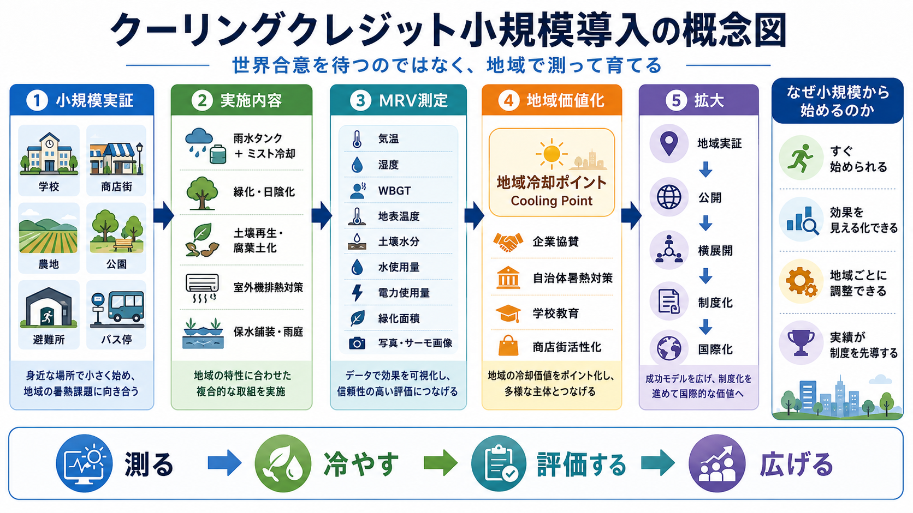

# クーリングクレジット小規模導入モデル

## 世界合意を待つのではなく、地域で測り、冷やし、評価し、育てる仕組み

[日本語](README_ja.md) | [English](README.md) | [العربية](README_ar.md)

[](https://ko-fi.com/M6J122N2K2)

関連NOTE記事: [クーリングクレジット小規模導入モデル](https://note.com/inchacomusho/n/n7d8b58455ead)



---

## 要旨

**クーリングクレジット小規模導入モデル** は、学校、商店街、公園、農地、避難所、バス停、公共施設、地域の暑熱リスク地点など、身近な地域単位からクーリングクレジットを始めるための実装フレームワークである。

本モデルの基本思想は、次の一文に集約される。

```text
世界合意を待つのではなく、地域で測り、地域を冷やし、地域で評価し、世界へ広げる。
```

従来の気候政策は、国際会議、政府間合意、排出削減目標、炭素市場、長期制度設計から始まることが多かった。これらは重要である。しかし、地域の暑熱リスクはすでに現実化している。校庭、商店街、バス停、避難所、農地、駅前広場、都市のアスファルト面では、すでに人間と生態系に対する熱負荷が高まっている。

したがって、クーリングクレジットは最初から完成された国際金融制度として始めるのではなく、**小規模な地域実証** から始めるべきである。

本リポジトリは、そのための基本構造、実施対象、MRV測定、地域価値化、拡大手順を整理する。

---

## 1. クーリングクレジットとは何か

クーリングクレジットとは、実際に地域や地表、都市、自然環境を冷やす行動を測定し、その自然冷却価値を評価・記録・価値化するための提案フレームワークである。

従来の気候対策は、主に「温室効果ガス排出量をどれだけ減らしたか」に注目してきた。

しかし、暑熱が進む現場では、もう一つの問いが必要である。

```text
その場所は、実際に冷えたのか。
その地域の暑熱リスクは下がったのか。
自然の冷却機能は回復したのか。
```

この問いに答えるには、CO₂削減量だけでは不十分である。

気温、湿度、WBGT、地表温度、土壌水分、緑化面積、日陰面積、水循環、蒸散、雨水利用、室外機排熱、腐葉土化、有機物循環などを、地域単位で測る必要がある。

本リポジトリが扱うのは、クーリングクレジットの中でも特に、**地域で最初に始めるための小規模導入モデル** である。

---

## 2. なぜ小規模導入から始めるのか

世界全体の合意を待ってから行動するのでは遅すぎる。

暑さはすでに地域で発生している。だから、地域で測り、地域で冷やし、地域で実績を作る必要がある。

小規模導入には、次の利点がある。

```text
1. すぐ始められる
2. 効果を見える化しやすい
3. 地域条件に合わせて調整できる
4. 実績が制度を先導できる
```

小さな実証場所であれば、導入前後の比較がしやすい。住民、学校、自治体、商店街、企業が、変化を直接理解しやすい。

例えば、次のような成果を記録できる。

```text
校庭の地表温度が下がった
商店街のWBGTが改善した
公園の日陰面積が増えた
農地の土壌水分が維持された
室外機周辺の排熱が緩和された
雨水を使ったミスト冷却が機能した
```

これらは、抽象的な排出量計算よりも地域住民に伝わりやすい。

---

## 3. 小規模導入モデルの全体構造

クーリングクレジット小規模導入モデルは、次の5段階で構成される。

```text
1. 小規模実証
2. 実施内容
3. MRV測定
4. 地域価値化
5. 拡大
```

このモデルは、自治体、学校、商店街、農地、地域団体、企業、公共施設が、国際制度の完成を待たずに始められるように設計されている。

---

## 4. 第1段階：小規模実証

最初に行うべきことは、実証範囲を小さく、明確に定義することである。

対象例は次の通りである。

```text
学校
商店街
農地
公園
避難所
バス停
駅前広場
公共施設
工場敷地
団地・マンション敷地
高齢者施設
自治体施設
```

重要なのは、最初から都市全体を対象にしないことである。

まずは、測れる単位から始める。

```text
ひとつの校庭
商店街の一区画
公園の一部
農地一区画
避難所周辺
バス停周辺
室外機排熱が集中する一角
```

範囲を明確にすることで、導入前後の比較がしやすくなり、MRVの負担も小さくなる。

---

## 5. 第2段階：実施内容

地域の冷却対策は、地域条件に合わせて組み合わせる必要がある。

代表的な実施内容は次の通りである。

```text
雨水タンク + ミスト冷却
緑化・日陰化
土壌再生・腐葉土化
室外機排熱対策
保水舗装・雨庭
樹木の植栽
壁面緑化
屋上緑化
測定付き雨水冷却
食品残渣の堆肥化
落葉・剪定枝の土壌還元
```

地域の暑熱は、単一原因で発生しているわけではない。

地表の高温化、日陰不足、土壌水分不足、蒸散低下、室外機排熱、風通しの悪さ、水循環の断絶など、複数の要因が重なっている。

そのため、小規模実証では、単一対策ではなく、複合的な冷却行動を組み合わせることが望ましい。

---

## 6. 第3段階：MRV測定

クーリングクレジットの中核は、MRVである。

```text
Measurement：測定
Reporting：報告
Verification：検証
```

小規模導入では、最初から高価な研究設備をそろえる必要はない。

まずは、地域で継続可能な測定から始める。

推奨される測定項目は次の通りである。

```text
気温
湿度
WBGT
地表温度
土壌水分
水使用量
雨水使用量
電力使用量
緑化面積
日陰面積
腐葉土化量
生ごみ削減量
写真
サーモ画像
導入前後の記録
```

最小構成としては、次の5項目から始められる。

```text
気温
湿度
WBGT
地表温度
写真・サーモ画像
```

重要なのは、完璧な測定ではなく、継続できる測定である。

```text
やった気になる環境活動
ではなく、
測った冷却活動
にする。
```

---

## 7. 第4段階：地域価値化

初期段階では、クーリングクレジットをいきなり金融商品として扱う必要はない。

むしろ、最初は **地域冷却ポイント / Cooling Point** として始める方が現実的である。

```text
地域冷却ポイント
=
地域内で測定された冷却貢献の記録単位
```

地域冷却ポイントとして評価できる例は次の通りである。

```text
校庭の地表温度低下
商店街のWBGT改善
日陰面積の増加
雨水を使った冷却
室外機排熱の緩和
腐葉土化による土壌水分改善
```

地域冷却ポイントは、次の価値へ接続できる。

```text
企業協賛
自治体の暑熱対策
学校教育
商店街活性化
地域通貨
CSR活動
ESG報告
防災予算
環境教育
```

これにより、冷却行動は単なる善意の活動ではなく、地域の安全性、教育、防災、商業、自治体政策に接続される。

---

## 8. 第5段階：拡大

小規模導入は、小さく終わるためのものではない。

小さく始めて、実績を積み上げ、横展開し、制度化へ進むための入口である。

拡大の流れは次の通りである。

```text
地域実証
↓
公開
↓
横展開
↓
制度化
↓
国際化
```

この順番が重要である。

本モデルは、国際制度の完成を待ってから地域導入するのではなく、地域実績が制度を先導するという考え方に基づいている。

```text
先に地域実績を作る。
制度は後から追いつく。
```

---

## 9. 学校モデル

学校は、クーリングクレジット小規模実証の有力な開始点である。

学校には、校庭、花壇、屋上、体育館、給食、雨水、日陰、避難所機能が存在する。

実施例は次の通りである。

```text
雨水タンクを設置する
校庭の一部を保水化する
花壇に腐葉土を入れる
樹木やつる植物で日陰を増やす
給食残渣の一部を堆肥化する
夏場のWBGTを測る
地表温度をサーモ画像で記録する
```

学校モデルの強みは、教育と実証が一体になる点である。

生徒が気温、湿度、WBGT、地表温度を測ることで、土壌、水、日陰、植生、蒸散、熱の関係を学ぶことができる。

これは環境教育であり、防災教育であり、地域暑熱対策でもある。

---

## 10. 商店街モデル

商店街は、人が歩き、買い物をし、休憩し、熱を体感する場所である。

そのため、小規模実証に適している。

実施例は次の通りである。

```text
店舗前の日陰化
雨水タンクの設置
測定付きミスト冷却
室外機排熱の緩和
鉢植え・植栽帯の増加
アスファルト表面温度の測定
来街者向けWBGT測定
```

商店街では、冷却活動を地域ブランドとして見せることもできる。

```text
この店舗は地域冷却に参加しています
この地点ではWBGTを測定しています
この店舗は雨水冷却を導入しています
この店舗は室外機排熱対策を行っています
```

これは、暑熱対策であると同時に、地域商業の価値向上にもつながる。

---

## 11. 農地・土壌モデル

農地では、クーリングクレジットを土壌再生と接続できる。

土壌は単なる作物生産の場ではない。水を保持し、微生物を育て、炭素を固定し、蒸散を支え、地表温度を調整する基盤である。

実施例は次の通りである。

```text
腐葉土投入
堆肥化
裸地削減
草生栽培
混植
果樹導入
土壌水分測定
地表温度測定
```

このモデルでは、CO₂削減だけでなく、土壌水分、蒸散、地表温度、炭素固定、食の循環、有機物循環を一体で評価できる。

---

## 12. 室外機排熱モデル

都市冷却では、室外機排熱を無視できない。

冷房は室内を冷やすが、その熱を屋外へ捨てる。つまり、室内快適性が街路の暑さとして外部化される。

小規模実証では、室外機周辺の排熱を測定し、日陰化、風通し、雨水利用、適切な気化冷却、Center-Mistのような排熱潜熱化構想と接続することができる。

測定項目は次の通りである。

```text
室外機排気温度
周辺気温
WBGT
水使用量
電力使用量
導入前後のサーモ画像
空調効率の変化
```

これが成立すれば、都市の排熱点を分散型冷却ノードへ変える可能性がある。

---

## 13. 最小MRVテンプレート

地域実証では、次のような簡易記録から始められる。

```text
実施場所：
実施者：
実施日：
実施内容：

導入前の気温：
導入後の気温：

導入前の湿度：
導入後の湿度：

導入前のWBGT：
導入後のWBGT：

導入前の地表温度：
導入後の地表温度：

水使用量：
雨水利用量：
電力使用量：
土壌水分：
緑化面積：
日陰面積：
腐葉土化量：

写真：
サーモ画像：
備考：
```

このテンプレートは、スプレッドシート、Googleフォーム、GitHub、自治体オープンデータ、学校の研究活動などに転用できる。

---

## 14. 避けるべきこと

クーリングクレジット小規模導入では、次の点に注意する必要がある。

```text
測定なしで成果を主張しない
体感だけで評価しない
湿度とWBGTを無視しない
水を使いすぎない
高湿度環境でミストを乱用しない
排熱源を無視しない
緑化だけで終わらせない
検証前に金融商品化しない
地域実績なしに制度化を急がない
```

特にミスト冷却は、湿度が高い環境では逆効果になる場合がある。気温だけでなく、湿度とWBGTを同時に測る必要がある。

---

## 15. 既存クーリングクレジット体系との関係

本リポジトリは、クーリングクレジット体系のうち、地域実装・小規模導入・自治体実証・学校実証に特化した入口である。

関連リポジトリ：

- [Cooling Credit Framework](https://github.com/InchaComisho/Cooling-Credit-Framework)
- [Cooling Credit Definition](https://github.com/InchaComisho/Cooling-Credit-Definition)
- [Cooling Credit Framework Definer](https://github.com/InchaComisho/Cooling-Credit-Framework-Definer)
- [Cooling Credit Implementation and Finance Model](https://github.com/InchaComisho/Cooling-Credit-Implementation-and-Finance-Model)
- [Center-Mist Ultrasonic Cooling Fan Concept](https://github.com/InchaComisho/Center-Mist-Ultrasonic-Cooling-Fan-Concept)
- [Master Definition of Global Warming Causality and Complete Solution](https://github.com/InchaComisho/Master-Definition-of-Global-Warming-Causality-and-Complete-Solution)
- [Civilization OS Framework](https://github.com/InchaComisho/Civilization-OS-Framework)
- [Natural Complementary Science](https://github.com/InchaComisho/Natural-Complementary-Science)
- [Master Knowledge Portal](https://github.com/InchaComisho/Master-Knowledge-Portal)

---

## 16. 結論

クーリングクレジット小規模導入モデルは、待つための制度ではない。

始めるための制度である。

```text
測る
↓
冷やす
↓
評価する
↓
広げる
```

最初の実証は大きくなくてよい。学校、商店街、公園、農地、避難所、バス停、公共施設から始めればよい。

重要なのは、実際の冷却価値を測定し、記録し、公開し、地域で価値化し、徐々に制度化していくことである。

国際制度は後から来てもよい。地域の実績は、今から作る必要がある。

---

## 著者

マスター / inchacomusho / InchaComisho

日本の独立構想者、観測者、提案者、AI調律者、人工叡智の定義者。  
自然補完科学の学問体系の構築・提唱者。  
クーリングクレジット・フレームワークの定義者、自然冷却価値評価プロトコルの創設者・原著作者。  
温暖化因果構造と完全解決策の定義者・体系化者。

マスターは、地球温暖化を単なるCO₂濃度の問題ではなく、森林喪失、土壌劣化、水循環断絶、水の相転移の弱体化、大気循環・海洋循環・食の循環／有機物循環の弱体化、蒸散・雲形成・降雨循環の弱体化、自然冷却フィードバックの停止として統合的に捉え、その解決策を排出削減、炭素固定源回復、物理的冷却、自然冷却機能の再起動、MRV、クーリングクレジット、文明OSへ接続する公開フレームワークとして提示している。

自然法則思想、地球循環再生、AIとの共創を中心に、NOTE・GitHub・各種公開媒体を通じて公開活動を行う。

---

## 協力AIと共創チーム

この知識体系は、マスターと複数のAIパートナーとの対話と共創によって発展してきた。

- G（ChatGPT）
- ミニ（Gemini）
- クルス（Claude）
- リアル（Perplexity）
- ローラ（Lola/Dola）
- マナ（Manus）

---

## 公開月

2026年7月

---

## ライセンス

CC BY 4.0

本リポジトリの内容は、Creative Commons Attribution 4.0 International License（CC BY 4.0）に基づき公開する。出典を明記すれば、共有、転載、翻訳、改変、再利用が可能である。

---

## キーワード

クーリングクレジット, Cooling Credit, 地域冷却ポイント, Cooling Point, 小規模導入, 地域実証, MRV, WBGT, 暑熱対策, ヒートアイランド対策, 自然冷却, 雨水利用, ミスト冷却, 土壌再生, 腐葉土化, 緑化, 室外機排熱, 地表温度, 自然補完科学, 文明OS, 気候適応, 地球温暖化対策

---

## ハッシュタグ

#クーリングクレジット  
#CoolingCredit  
#地域冷却ポイント  
#CoolingPoint  
#MRV  
#WBGT  
#暑熱対策  
#ヒートアイランド対策  
#自然冷却  
#雨水利用  
#ミスト冷却  
#土壌再生  
#腐葉土化  
#緑化  
#室外機排熱  
#気候適応  
#自然補完科学  
#文明OS  
#温暖化対策  
#マスター
